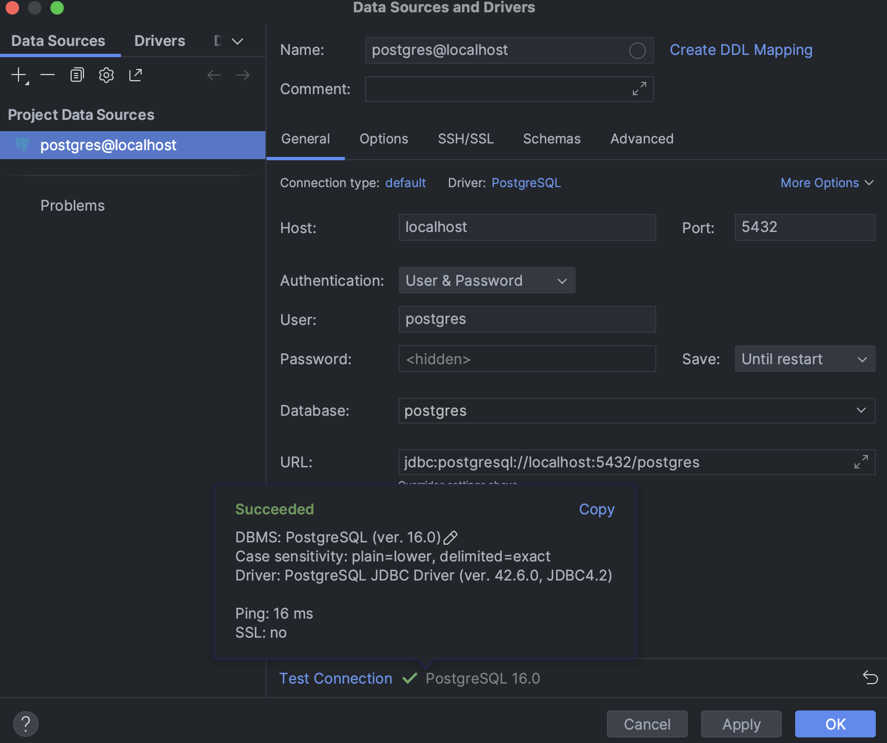
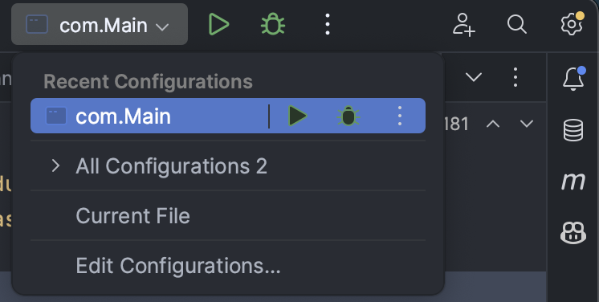
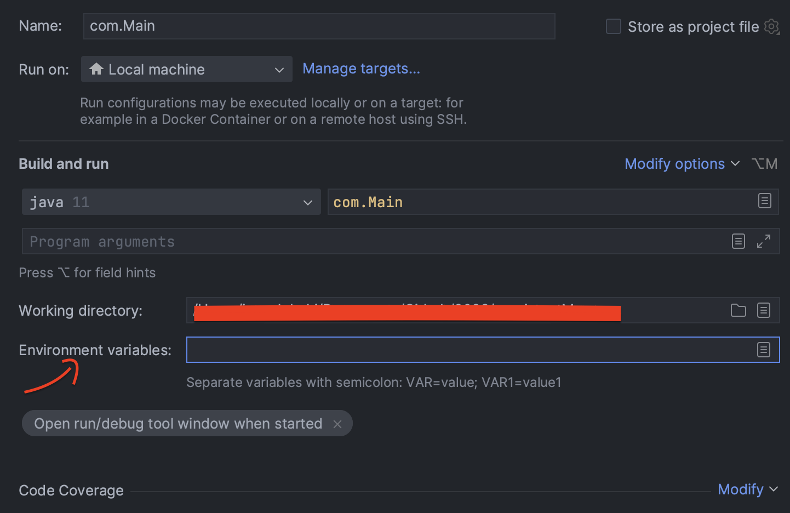
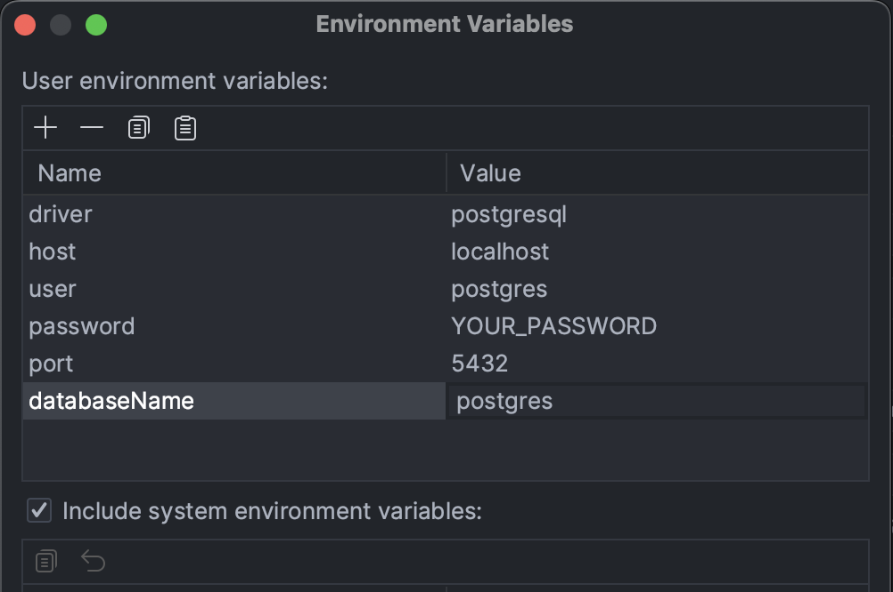

# persistantManager

- Langage Utilisé : Java
- Dependance : Maven
- Base de Données : PostgreSQL

* Projet qui permet de Recupérer les éléments se trouvant dans la Base de Données (BD) pour les insérer dans les beans (Class) Utilisées : @See Retrieve()
  - Etudiant.class
  - Cours.Class
  - Inscription.class
  
* Le Projet implémente également une Methode permettant d'insérer les données provenant de notre Application (Beans) dans le Base de Données : @See BulkInsert()
* Le projet implémente un module pour la connexion dans la base de données, ce qui permet une facilité de changement de la Base de Données (Passer de PostgreSQL à Oracle par exemple)

Prerequis:
- Démarrer connection avec PostgreSQL, configurer votre connection de la base de données 
en remplaçant les valeurs d'environnement pour vos valeurs.
<pre>
  public static ImportingDatabase getInstance() {
        if (con == null) {
            Injector inject = Guice.createInjector(new ImportingDatabaseModule());
            ImportingDatabase.instance = inject.getInstance(ImportingDatabase.class);
            ImportingDatabase.instance.entity.setLoginConnection(
                System.getenv("driver"),
                System.getenv("host"),
                System.getenv("user"),
                System.getenv("password"),
                Integer.parseInt(System.getenv("port")),
                System.getenv("databaseName")
            );
        }
        return instance;
    }
</pre>

- Créer votre base des données postgresql au préalable, puis tester votre connexion


- Aller sur ```Edit Configuration``````, pour ajouter vos informations de connexion



- Saisissez les identifiants de connexion de votre base des données


  
<!-- - Copier-coller ces instructions sur votre console SQL postgresql
  <pre>
  -- CREATION SEQUENCES
  CREATE SEQUENCE etudiant_seqs START 10;
  CREATE SEQUENCE cours_seqs START 100;
  CREATE SEQUENCE inscription_seqs START 1;

  CREATE TABLE IF NOT EXISTS etudiant (
    etudiantid INTEGER PRIMARY KEY,
    lname VARCHAR(255) NOT NULL,
    fname VARCHAR(255) NOT NULL,
    age INTEGER NOT NULL
  );
  
  CREATE TABLE IF NOT EXISTS cours (
    coursid INTEGER PRIMARY KEY,
    nameCours VARCHAR(100) NOT NULL,
    sigle VARCHAR(25) NOT NULL,
    description TEXT NOT NULL
  );
  
  CREATE TABLE IF NOT EXISTS inscription (
    inscriptionid INTEGER PRIMARY KEY,
    etudiantid INTEGER NOT NULL,
    coursid INTEGER NOT NULL
  );
  </pre> -->